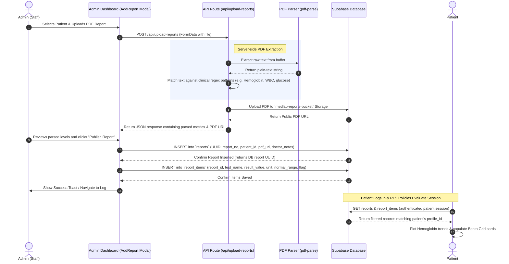

# Laboratory Report Extraction and Dashboard Syncing Pipeline

This document outlines the architecture, data flow, and processing pipeline for uploading, parsing, and storing clinical blood laboratory reports in the MedLab system.

---

## 1. System Flow Overview

The diagram below details the sequence of operations from the moment an administrator drops a PDF laboratory report in the Admin panel to the moment the patient views the extracted blood metrics on their personal dashboard.

---

## 2. Dynamic Component Details

### A. Server-Side Extraction (`/api/upload-reports`)

- **File Upload**: Handled via standard Next.js `multipart/form-data` request routing.
- **Parsing Engine**: Node.js `pdf-parse` reads the PDF structure and outputs a clean text string.
- **Regex Extraction**: Custom regular expressions run against the output text to parse common panels:
  - **Hemoglobin**: `Hemoglobin\s*:\s*([\d\.]+)\s*(g/dL)?`
  - **White Blood Cell (WBC)**: `(?:WBC|White Blood Cell)\s*:\s*([\d\.]+)\s*(x10\^3/uL)?`
  - **Blood Sugar / Fasting Glucose**: `(?:Blood Glucose|Fasting Blood Sugar|Sugar)\s*:\s*([\d\.]+)\s*(mg/dL)?`
  - **Cholesterol**: `(?:Total Cholesterol|Cholesterol)\s*:\s*([\d\.]+)\s*(mg/dL)?`
- **Fallback Presets**: If text extraction yields 0 matching panels (e.g., if the PDF is a scanned image with no OCR layer), the API returns a rich predefined clinical preset so that the UI experience remains complete and functional.

### B. Database Syncing and Storage

- **File Repository**: The PDF file is persisted directly in Supabase Storage (`medlab-reports-bucket`).
- **Main Record Table (`reports`)**:
  - `id`: Unique Auto-generated UUID.
  - `report_no`: Reference tracking ID generated from form.
  - `patient_id`: Foreign key link to `patients.id`.
  - `pdf_url`: Public link to the file stored in Supabase.
  - `status`: Set to `published`.
- **Telemetry Table (`report_items`)**:
  - Contains individual rows linked to the main report via `report_id` UUID.
  - Stores `test_name`, `result_value`, `unit`, `normal_range`, and dynamic `flag` (`NORMAL`, `HIGH`, `LOW`, `CRITICAL`).

### C. Patient Authentication and Authorization (RLS)

- Access controls are enforced at the database layer using Supabase **Row Level Security (RLS)**:
  - **Staff/Admin**: JWT check allows viewing and managing all profiles, patients, and reports.
  - **Patients**: RLS policies restrict SELECT operations to only rows where `patients.profile_id = auth.uid()`, guaranteeing HIPAA-compliant data separation.
