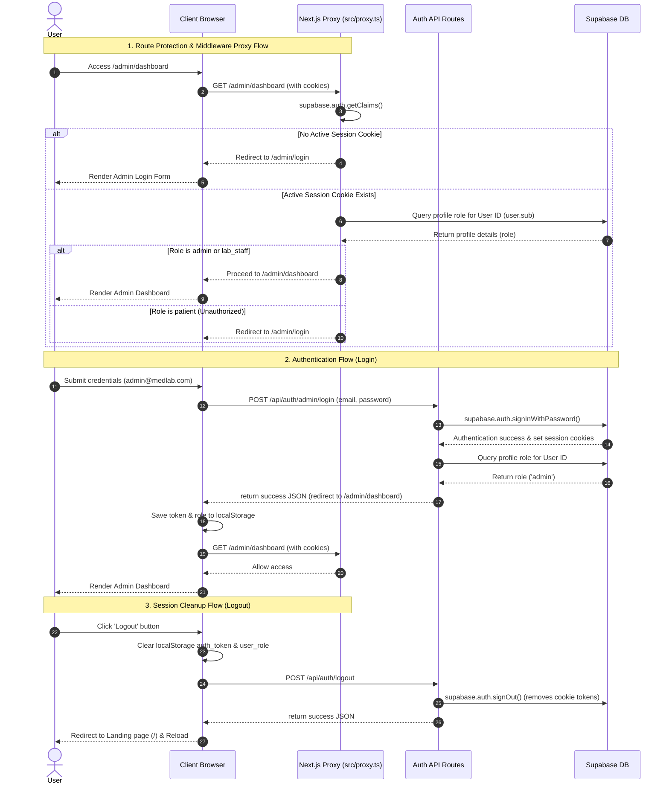

# LIS Authentication & Access Control Flow

This document details the login, route protection, and logout mechanics implemented across the MedLab LIS application.

---

## 1. Sequence & Flow Diagram

The diagram below illustrates how route access is protected by the Next.js middleware proxy, and how authentication/logout requests are routed and checked.

---

## 2. Component Explanations

### A. Middleware Proxy (`src/proxy.ts` & `src/lib/supabase/proxy.ts`)

- **Location**: Runs on Next.js edge-runtime/server-side boundaries.
- **Paths Protected**: `/admin/dashboard` (and subpaths), `/patient/dashboard` (and subpaths).
- **Behavior**:
  1. Calls `supabase.auth.getClaims()` to verify if a valid JWT exists in cookies.
  2. If none is found, redirects `/admin/*` to `/admin/login` and `/patient/*` to `/patient/login`.
  3. If found, queries the user's role in the `profiles` table to prevent role cross-access (e.g. a patient cannot view admin metrics, and vice versa).
  4. Automatically redirects authenticated users *away* from login pages (e.g., if a logged-in admin tries to open `/admin/login`, they are instantly pushed to `/admin/dashboard`).

### B. Login API Endpoints (`/api/auth/admin/login` & `/api/auth/patient/login`)

- **Responsibility**: Authenticating credentials securely on the server.
- **Cookie Syncing**: Using `@supabase/ssr` to configure cookies correctly in browser headers, which are sent back on downstream requests.
- **Verification**: Verifies role matches the login route before returning success. If not, it signs them out immediately to keep the auth state clean.

### C. Logout API Endpoint (`/api/auth/logout`)

- **Responsibility**: Clearing server-side authentication state.
- **Mechanism**: Calls `supabase.auth.signOut()`, which clears all Supabase-related authentication cookies (`sb-...-auth-token`) from the browser response.
- **Client cleanup**: Coordinated with local clearing of `auth_token` and `user_role` in `localStorage`.
