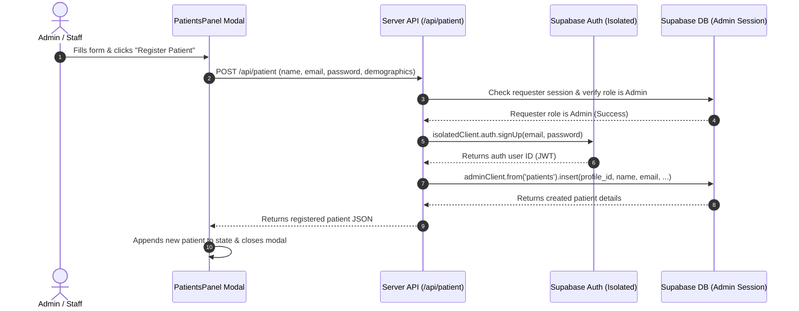

# Patient Registration Implementation Details

This document explains the architecture and implementation of the patient registration feature in the MedLab LIS portal.

---

## 1. The Problems Identified

1. **Missing Environment Keys on the Client**:
   - The client-side configuration was looking for `NEXT_PUBLIC_SUPABASE_ANON_KEY`, which is not set in `.env.local` (only `NEXT_PUBLIC_SUPABASE_PUBLISHABLE_KEY` is present). This caused the system to fallback to a simulated/offline local storage state, preventing real account generation.
   
2. **Session Interference on Signup**:
   - Calling `signUp` on the client-side using a standard client SDK instance can accidentally overwrite active session tokens in cookies/localStorage, resulting in the administrator being signed out.
   
3. **Double Database Inserts**:
   - Both the modal component (`PatientsPanel.tsx`) and the dashboard page (`page.tsx`) were executing database inserts for the same patient, leading to duplicate records and unique key constraint errors on emails.

---

## 2. Server-Side Registration Fix (`/api/patient`)

We introduced a secure, server-side Next.js route: [src/app/api/patient/route.ts](file:///c:/Users/harir/Desktop/medlabs-report/src/app/api/patient/route.ts) that handles registration:

1. **Admin Authorization**:
   - Retrieves the active session cookies of the requester via Next.js `cookies()`.
   - Validates that the active session belongs to a user with the `admin` or `lab_staff` role.
   
2. **Isolated User Creation**:
   - Creates a server-side browser client *without* cookies to sign up the new user:
     ```typescript
     const authClient = createBrowserClient(supabaseUrl, supabaseKey);
     const { data: authData, error: authError } = await authClient.auth.signUp({
       email,
       password,
       options: { data: { name, full_name: name, role: 'patient' } }
     });
     ```
   - This ensures the admin's cookie session remains completely untouched.

3. **Clinical Record Insertion**:
   - Inserts the new record into the `patients` table using the authenticated admin's client, linking the patient to the newly created user via `profile_id: authData.user.id`.

4. **Response**:
   - Returns the created patient record to the frontend.

---

## 3. UI Component Updates

- **PatientsPanel (`PatientsPanel.tsx`)**:
  - Updated to perform a `POST` request to `/api/patient` instead of performing inline Supabase actions.
  - Successfully parses server responses and calls the `onAddPatientLocal` callback on success.

- **Admin Dashboard Page (`page.tsx`)**:
  - Simplified `handleAddPatientLocal` to only trigger `fetchDashboardData()`, reloading the dashboard database telemetry instead of performing a duplicate insert.

- **Configuration Helper (`src/lib/supabase/index.ts`)**:
  - Updated the client-side config resolver to fall back to `NEXT_PUBLIC_SUPABASE_PUBLISHABLE_KEY` when `NEXT_PUBLIC_SUPABASE_ANON_KEY` is undefined.

---

## 4. Sequence & Logic Diagram



---

## 5. Verification & Visual Confirmation

The implementation has been thoroughly verified using a browser agent:

### A. Patient Registration Flow Recording
The recording below demonstrates filling out the patient registration form as an administrator, registering **Jane Doe**, and verifying she is successfully saved in the LIS database and displayed in the patient directory:

```carousel

```

---

### B. Patient Directory Log (Jane Doe Added)

```carousel

<!-- slide -->

```
